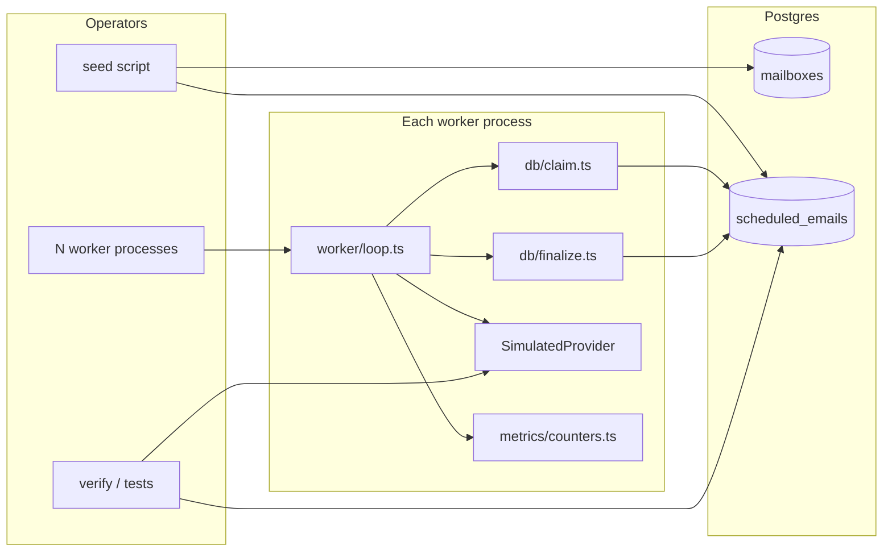
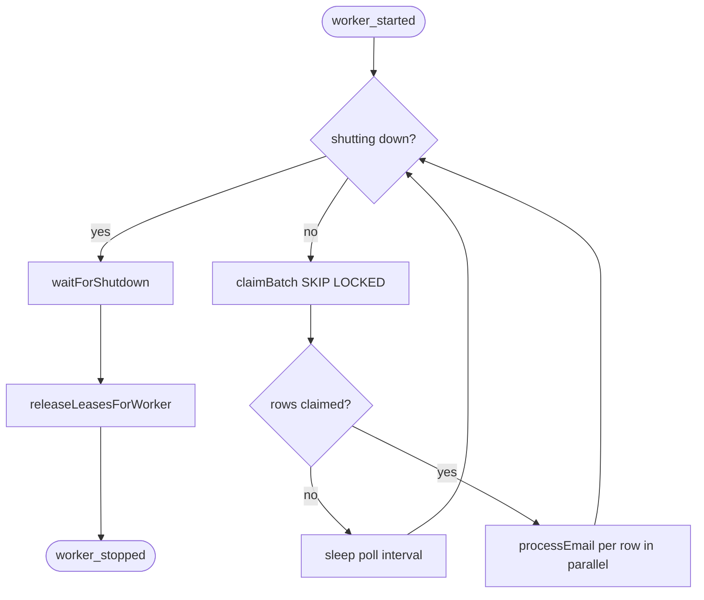
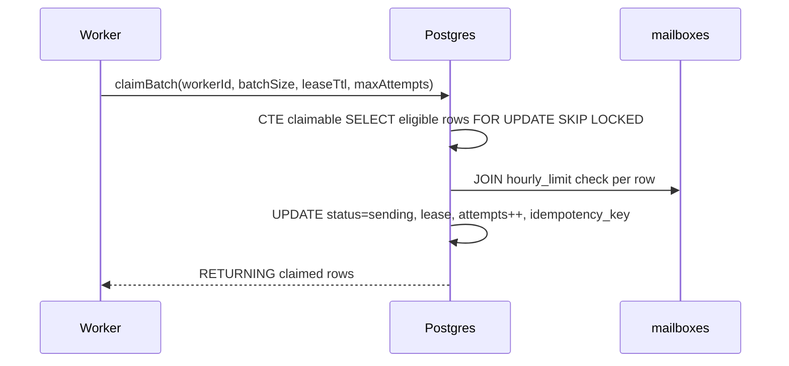
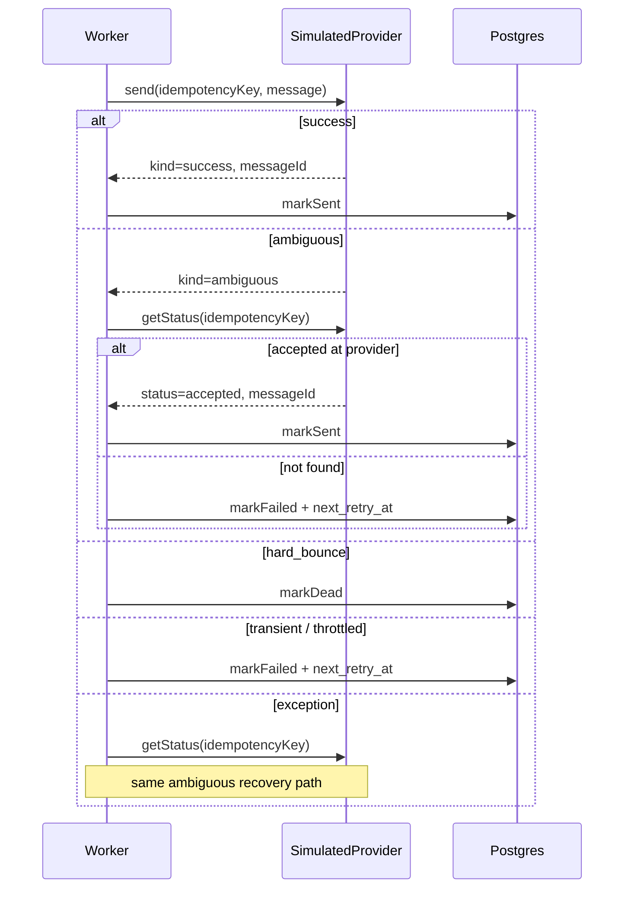
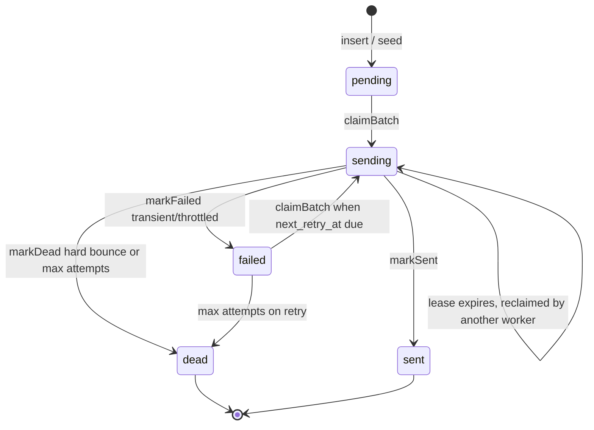

# Send Worker — Technical Design

## 1. Overview

This system drains a Postgres backlog of scheduled cold-outreach emails and sends each one through a simulated email provider. Many worker processes (across machines or containers) poll the same database concurrently; workers can crash mid-flight; the provider is slow and occasionally returns ambiguous timeouts after already accepting a message.

**What it does**

- Claims due emails atomically from `scheduled_emails`
- Sends via `SimulatedProvider.send(idempotencyKey, message)`
- Enforces per-mailbox rolling-hour caps at claim time
- Retries transient/throttled failures with capped exponential backoff + jitter
- Dead-letters hard bounces and max-attempt rows
- Shuts down cleanly on `SIGTERM` / `SIGINT`

**Delivery guarantee (stated explicitly)**

> **At-most-one visible provider accept per scheduled email.** Each row may be *processed* more than once (retries, lease reclaim after crash), but the combination of a stable idempotency key, provider-side dedup, and status reconciliation ensures the recipient sees at most one send.

This is not end-to-end exactly-once in the distributed-systems sense — it is **effectively-once delivery** with at-least-once processing attempts. The DB unique indexes on `idempotency_key` and `provider_message_id` catch invariant violations if something goes wrong.

Stack: **Node.js / TypeScript**, **Postgres 16**, **Vitest** for tests. Entry point: `src/index.ts` (`worker`, `migrate`, `seed` commands).

---

## 2. Architecture

### System context



### Worker loop

Each worker runs an infinite poll loop (`src/worker/loop.ts`):

1. If shutting down → exit loop
2. `claimBatch(...)` — atomic SKIP LOCKED claim of up to `WORKER_BATCH_SIZE` rows
3. If empty → sleep `WORKER_POLL_INTERVAL_MS` and repeat
4. For each claimed row → `processEmail` in parallel (tracked in `inFlight` set)
5. On shutdown signal → stop claiming, wait for in-flight sends (up to `WORKER_SHUTDOWN_TIMEOUT_MS`), release leases, log final metrics



### Claim flow

Claiming is a **single SQL statement** — no SELECT-then-UPDATE race window.



Implementation: `src/db/claim.ts` (`CLAIM_SQL`).

### Send flow



Implementation: `src/worker/loop.ts` (`processEmail`, `handleRetry`).

---

## 3. Data model

Schema: `migrations/001_init.sql`. Types: `src/db/types.ts`.

### Tables

**`mailboxes`**

| Column | Type | Notes |
|--------|------|-------|
| `id` | SERIAL PK | |
| `email_address` | TEXT UNIQUE | Sending account |
| `hourly_limit` | INTEGER | Max sends per rolling hour (> 0) |
| `created_at` | TIMESTAMPTZ | |

**`scheduled_emails`**

| Column | Type | Notes |
|--------|------|-------|
| `id` | BIGSERIAL PK | |
| `campaign_id` | INTEGER | Campaign grouping (no fairness logic yet) |
| `mailbox_id` | FK → mailboxes | Sending account |
| `to_address`, `subject`, `body` | TEXT | Payload |
| `scheduled_at` | TIMESTAMPTZ | Earliest send time |
| `status` | TEXT | `pending` \| `sending` \| `sent` \| `failed` \| `dead` |
| `attempts` | INTEGER | Incremented on each claim (default 0) |
| `idempotency_key` | UUID | Set once on first claim; never changed |
| `provider_message_id` | TEXT | Set on successful send |
| `leased_by` | TEXT | Worker ID holding lease |
| `leased_until` | TIMESTAMPTZ | Lease expiry for crash recovery |
| `next_retry_at` | TIMESTAMPTZ | Gate for `failed` rows |
| `last_error` | TEXT | Last failure reason |
| `sent_at` | TIMESTAMPTZ | Used for rolling-hour rate limit |
| `created_at`, `updated_at` | TIMESTAMPTZ | |

### Indexes

| Index | Purpose |
|-------|---------|
| `idx_scheduled_emails_claimable` on `(scheduled_at, mailbox_id) WHERE status IN ('pending','failed')` | Hot-path claim scan |
| `idx_scheduled_emails_sending_lease` on `(leased_until) WHERE status = 'sending'` | Expired lease reclaim |
| `idx_scheduled_emails_sent_rate` on `(mailbox_id, sent_at) WHERE status = 'sent'` | Rolling-hour count subquery |
| `idx_scheduled_emails_status` on `(status)` | Status aggregation / diagnostics |
| UNIQUE `idx_scheduled_emails_idempotency_key` | One key per row |
| UNIQUE `idx_scheduled_emails_provider_message_id` | One provider message per row |

### Status state machine



**Claim eligibility** (all must hold):

- Status is `pending`, `failed`, or expired `sending` (`leased_until < NOW()`)
- `scheduled_at <= NOW()`
- `next_retry_at IS NULL OR next_retry_at <= NOW()`
- `attempts < maxAttempts` (default 5)
- Mailbox rolling-hour sent count `< hourly_limit`

---

## 4. Component breakdown

| Layer | Files | Responsibility |
|-------|-------|----------------|
| **Config** | `src/config.ts` | Env-driven worker, provider, seed, metrics settings |
| **DB — claim** | `src/db/claim.ts` | Atomic SKIP LOCKED batch claim; `releaseLeasesForWorker` on shutdown |
| **DB — finalize** | `src/db/finalize.ts` | `markSent`, `markFailed`, `markDead`; diagnostic `countSentInLastHour` |
| **DB — rate limit** | `src/db/rateLimit.ts` | `sentCountLastHour` (tests/diagnostics; enforcement is in claim SQL) |
| **DB — pool** | `src/db/pool.ts` | Shared `pg` pool |
| **Provider** | `src/provider/simulated.ts`, `types.ts` | Configurable outcome rates, latency, idempotency dedup, `getStatus` |
| **Worker** | `src/worker/loop.ts` | Main poll loop, send orchestration, outcome routing |
| **Worker — retry** | `src/worker/retry.ts` | Backoff calculation, dead-letter threshold |
| **Worker — shutdown** | `src/worker/shutdown.ts` | `SIGTERM`/`SIGINT` controller |
| **Metrics** | `src/metrics/counters.ts` | In-process counters + periodic JSON summary logs |
| **Entry** | `src/index.ts` | CLI: `worker`, `migrate`, `seed` |

Each worker process owns one `SimulatedProvider` instance (in-memory dedup store is **per process** — see limitations below).

---

## 5. Core mechanisms

### 5.1 SKIP LOCKED claiming and lease recovery

The claim query in `src/db/claim.ts` uses a CTE + single UPDATE:

```sql
WITH claimable AS (
  SELECT e.id
  FROM scheduled_emails e
  JOIN mailboxes m ON m.id = e.mailbox_id
  WHERE (/* eligibility: status, schedule, retry, attempts, rate limit */)
  ORDER BY e.scheduled_at, e.id
  LIMIT $1
  FOR UPDATE OF e SKIP LOCKED
)
UPDATE scheduled_emails e
SET status = 'sending',
    leased_by = $2,
    leased_until = NOW() + ($3 * INTERVAL '1 second'),
    attempts = e.attempts + 1,
    idempotency_key = COALESCE(e.idempotency_key, gen_random_uuid()),
    updated_at = NOW()
FROM claimable c
WHERE e.id = c.id
RETURNING e.*;
```

**Why this is race-free**

- `FOR UPDATE OF e` takes row-level locks on selected rows inside one statement.
- `SKIP LOCKED` means workers never block on each other's locks — they skip locked rows and claim the next eligible ones.
- There is no gap between SELECT and UPDATE; Postgres serializes ownership in one round trip.

**Lease recovery (crash / kill -9)**

- Each claim sets `leased_by` and `leased_until = NOW() + leaseTtl` (default 60s).
- If a worker dies, rows stay in `sending` until `leased_until` passes.
- The claim query re-admits expired `sending` rows (same `idempotency_key`).
- A new worker re-sends with the same key; the provider dedupes if the first send was accepted.

**Graceful shutdown release**

- On `SIGTERM`/`SIGINT`, `releaseLeasesForWorker` sets owned `sending` rows to `failed` with `next_retry_at = NOW()` so another worker can pick them up immediately without waiting for lease expiry.

### 5.2 Idempotency and ambiguous timeouts

Three layers work together:

1. **Stable idempotency key (Postgres)** — assigned on first claim via `COALESCE(idempotency_key, gen_random_uuid())` and never rotated. Unique index enforces one key per row.

2. **Provider dedup (`SimulatedProvider`)** — `send(key, ...)` checks an in-memory `Map`. If the key was already accepted, it returns the original success without sending again. `messageId` is deterministic: `msg-` + first 16 hex chars of SHA-256(key), so cross-process retries get the same ID even if they hit different provider instances **only if** the provider store is shared (it is not in this implementation — see limitations).

3. **Ambiguous timeout path** — ~1% of sends accept at the provider but return `kind: 'ambiguous'`. The worker calls `getStatus(idempotencyKey)`:
   - If `status: 'accepted'` → `markSent` (provider got it before the client saw the ack)
   - If not found → schedule retry (genuine failure or accept not yet visible)
   - Same lookup runs in the `catch` block for unexpected exceptions

**Crash mid-flight scenario**

1. Worker A claims row, gets key `K`, provider accepts, worker crashes before `markSent`
2. Lease expires; Worker B reclaims with same key `K`
3. Worker B calls `send(K, ...)` → provider returns cached success (no second accept)
4. Worker B calls `markSent` → row terminal

### 5.3 Per-mailbox rate limiting

Enforcement is **inside the claim query**, not in application code:

```sql
(SELECT COUNT(*)::int FROM scheduled_emails s
 WHERE s.mailbox_id = e.mailbox_id
   AND s.status = 'sent'
   AND s.sent_at > NOW() - INTERVAL '1 hour')
< m.hourly_limit
```

**Properties**

- Mailboxes at cap are simply not selected; other mailboxes keep flowing.
- No global lock, no fleet-wide serialization.
- Rolling window: any `sent` row with `sent_at` in the last hour counts.
- Partial index `idx_scheduled_emails_sent_rate` keeps the subquery fast at review scale.

**Provider throttling** — when the provider returns `throttled`, the worker schedules retry with a longer base backoff (5 min vs 30 sec), reducing hammering on that mailbox without blocking others.

**Honest limitation:** this is a per-claim `COUNT(*)` subquery. At very high volume it becomes expensive; see §9.

### 5.4 Retry, backoff, and dead-letter policy

Logic: `src/worker/retry.ts`, routing: `src/worker/loop.ts`.

| Provider outcome | DB action | Retry? |
|------------------|-----------|--------|
| `success` | `markSent` | No |
| `ambiguous` + `getStatus` found | `markSent` | No |
| `ambiguous` + `getStatus` null | `markFailed` | Yes |
| `hard_bounce` | `markDead` | No |
| `transient` | `markFailed` | Yes |
| `throttled` | `markFailed` (longer backoff) | Yes |
| Exception + no `getStatus` | `markFailed` | Yes |
| `attempts >= maxAttempts` (default 5) | `markDead` | No |

**Backoff formula** (`computeRetryAt`):

```
delay = min(15 min, base × 2^(attempts - 1)) + random jitter(0..5s)
```

- Transient base: **30 seconds**
- Throttled base: **5 minutes**
- Cap: **15 minutes**
- `attempts` is incremented on claim; first send attempt has `attempts = 1`

Rows in `failed` become claimable when `next_retry_at <= NOW()`. Rows in `dead` are never claimed again.

### 5.5 Graceful shutdown

`src/worker/shutdown.ts` registers `SIGTERM` and `SIGINT`.

On signal (`src/worker/loop.ts`):

1. Set shutting-down flag → loop stops claiming new batches
2. Stop periodic metrics timer; log summary
3. Wait up to `WORKER_SHUTDOWN_TIMEOUT_MS` (default 30s) for in-flight `processEmail` promises
4. `releaseLeasesForWorker` — owned `sending` rows → `failed` with `next_retry_at = NOW()`
5. Log `worker_stopped` and exit

In-flight sends that complete before timeout are finalized normally (`markSent` / `markFailed` / `markDead`). Unfinished work is released for immediate reclaim, not lost.

### 5.6 Observability

**Structured logs** — every event is a JSON line via `logEvent` in `src/metrics/counters.ts`:

| Event | Meaning |
|-------|---------|
| `worker_started` / `worker_stopped` | Lifecycle |
| `email_sent` | Successful delivery |
| `email_sent_ambiguous_recovered` | Ambiguous → resolved via `getStatus` |
| `email_sent_after_error_status_lookup` | Exception → resolved via `getStatus` |
| `email_retry_scheduled` | Transient/throttled failure |
| `email_dead` / `email_dead_max_attempts` | Terminal failure |
| `leases_released_on_shutdown` | Graceful shutdown lease release |

**Periodic metrics summary** (default every 30s): `claims`, `sent`, `retried`, `failed`, `dead`, `ambiguousRecovered`, `uptimeSec`, `emails_per_minute`.

No HTTP `/metrics` endpoint — stdout only. Counters are per-process, not aggregated across workers.

---

## 6. Design decisions and trade-offs

| Decision | Rationale | Cost |
|----------|-----------|------|
| **Postgres polling** vs dedicated queue | Single datastore, SKIP LOCKED is battle-tested, no extra infra for a time-boxed exercise | Latency floor = poll interval; constant DB load when idle |
| **Claim-time rate limit** vs external rate-limit service | Correctness in one query; no drift between counter and claim | `COUNT(*)` per candidate row at scale |
| **Rolling-hour via `sent_at`** vs token bucket | Simple, auditable, matches problem statement | Not a precise token bucket; edge effects at window boundary |
| **Lease + idempotency key** vs long transactions | Worker can hold lease across slow provider call without open txn | Reclaim delay = lease TTL after hard kill |
| **Simulated provider** vs real SMTP | Focus on pipeline correctness; configurable chaos | In-memory store limits cross-process dedup story |
| **Parallel sends within batch** | Throughput; mailboxes are independent | One slow send does not block siblings in the batch |
| **No campaign fairness** | Out of time / scope for core bar | Large campaigns can starve small ones |

---

## 7. Design questions

These are the five questions from the assignment brief (`problem.txt` §6). Answered directly against this implementation.

### 7.1 How does claiming stay race-free under N workers, and what is the database actually doing for you?

Claiming is one atomic statement: a CTE selects eligible rows with `FOR UPDATE OF e SKIP LOCKED`, then an `UPDATE … FROM claimable` transitions them to `sending` in the same query (`src/db/claim.ts`).

Postgres provides **row-level locks** and **MVCC**. `FOR UPDATE` ensures only one transaction can claim a given row; `SKIP LOCKED` ensures workers never block each other — they skip rows another worker is locking and take the next eligible ones. There is no SELECT-then-UPDATE window, which is the classic double-claim bug.

The database also gates eligibility: schedule time, retry time, attempt count, and per-mailbox rate limit are all evaluated in SQL so every worker sees a consistent snapshot of what is claimable.

### 7.2 What's your delivery guarantee, and how do you achieve it? How do you handle the ambiguous provider timeout?

**Guarantee:** at-most-one provider accept (and thus at-most-one visible send) per scheduled email, with at-least-once processing attempts.

**Mechanisms:**

1. Stable `idempotency_key` set on first claim, stored in Postgres (unique index).
2. Provider dedup — `SimulatedProvider.send(key, …)` returns the cached success if the key was already accepted.
3. Outcome routing in `processEmail` — success → `markSent`; hard bounce → `markDead`; transient/throttled → retry.
4. **Ambiguous timeout** (~1%): provider accepts but returns `kind: 'ambiguous'`. Worker calls `getStatus(key)`:
   - Found → treat as success (`email_sent_ambiguous_recovered`)
   - Not found → retry later (may have been a true timeout)
5. Same `getStatus` fallback on uncaught exceptions.
6. Crash recovery: lease expires → reclaim with same key → provider dedup prevents second accept.

Unique indexes on `idempotency_key` and `provider_message_id` are a safety net at the DB layer.

**Limitation:** provider dedup is an in-memory `Map` per process. In production, dedup must be a **provider API contract** (idempotency key header) plus optional reconciliation job. Multiple worker processes each have their own provider instance here; deterministic `messageId` from the key helps cross-process consistency when the provider store is shared, but this codebase does not share it across processes.

### 7.3 How do you enforce per-mailbox limits without serialising the whole fleet?

The claim query joins `mailboxes` and excludes any row whose mailbox has `COUNT(*) of sent rows in the last hour >= hourly_limit`. Mailboxes at cap are filtered out at selection time; workers continue claiming rows for other mailboxes in the same batch.

No global mutex, no single-threaded sender. Throttled provider responses get longer backoff (5 min base) to avoid hammering a hot mailbox.

The partial index on `(mailbox_id, sent_at) WHERE status = 'sent'` supports the count subquery.

### 7.4 What's your retry, backoff, and dead-letter policy?

| Outcome | Action |
|---------|--------|
| Transient error | `status = failed`, exponential backoff from **30s** base + jitter |
| Throttled | Same, but **5 min** base backoff |
| Hard bounce | `status = dead` immediately — no retry |
| Max attempts (default **5**, set on claim) | `status = dead` |

Backoff: `min(15 min, base × 2^(attempts − 1)) + random(0..5s)`. Rows in `failed` are reclaimable when `next_retry_at <= NOW()`. Rows in `dead` are never claimed again.

`shouldDeadLetter(attempts, maxAttempts)` returns true when `attempts >= maxAttempts` — because `attempts` is incremented on claim, the fifth attempt that still fails is dead-lettered.

### 7.5 What did you deliberately cut, and what would you change to handle 10M+ sends/day across many machines?

**Deliberately cut (time-boxed exercise)**

- Postgres polling instead of Redis / SQS / Kafka / LISTEN-NOTIFY wakeups
- Rolling-hour cap via SQL subquery, not a dedicated rate-limit service or materialized counters
- No campaign fairness / round-robin scheduling
- No circuit breaker or adaptive provider back-pressure
- Simulated provider — no real SMTP, no webhook reconciliation with provider logs
- In-process metrics and logs only — no Prometheus `/metrics` endpoint
- Single Postgres instance — no partitioning, no read replicas for claim path
- Provider dedup store is per-process memory, not a shared or durable store

**Changes for 10M+ sends/day**

- **Partition / archive `scheduled_emails`** by time or tenant; move `sent` rows off the hot claim path
- **Outbox or queue** for claim notifications to eliminate idle polling; consider `LISTEN/NOTIFY` or a broker for wakeups
- **Dedicated rate-limit counters** — Redis sliding windows or increment-on-send materialized counts updated atomically with `markSent`, avoiding per-claim `COUNT(*)`
- **Provider idempotency as first-class API** — idempotency key on every send; async reconciliation job for ambiguous timeouts using provider webhooks or status API (not in-process `getStatus`)
- **Shorter leases + horizontal workers** with sticky mailbox affinity optional for cache locality
- **Observability at volume** — Prometheus metrics, trace IDs per email, dead-letter dashboards, alert on stuck `sending` rows
- **Multi-region** — regional outboxes, conflict-free idempotency at provider, avoid cross-region Postgres writes on the hot path

The core primitives (SKIP LOCKED, stable idempotency key, lease reclaim) remain the foundation; the surrounding infrastructure would change.

---

## 8. Verification

### Automated pillar checks

```bash
docker compose up -d postgres
npm run migrate
npm run verify    # scripts/verify.ts — targeted pillar checks
npm test          # full Vitest suite
```

**`npm run verify`** (`scripts/verify.ts`) runs isolated checks:

| Check | What it proves |
|-------|----------------|
| SKIP LOCKED — disjoint parallel claims | 3 concurrent clients claim 15 rows with zero overlap |
| Idempotency — stable key on lease reclaim | Same `idempotency_key` after expired lease reclaim |
| Idempotency — provider dedup by key | Second `send(sameKey)` → one provider accept |
| Idempotency — ambiguous timeout recovered | Worker + 100% ambiguous provider → `sent` via `getStatus` |
| Rate limit — capped mailbox blocked | Mailbox at cap not claimed; open mailbox still flows |
| Retry — backoff bases and 15 min cap | Transient ~30s, throttled ~5min, attempt 10 capped |
| Retry — dead-letter at max attempts | `attempts >= maxAttempts` → dead |

### Vitest suite

| File | Coverage |
|------|----------|
| `tests/claim.test.ts` | SKIP LOCKED, lease metadata, parallel disjoint claims, reclaim, retry gates |
| `tests/rateLimit.test.ts` | Rolling-hour caps, other mailboxes unaffected |
| `tests/provider.test.ts` | Outcome bands, dedup, ambiguous + `getStatus`, deterministic messageId |
| `tests/retry.test.ts` | Backoff math, dead-letter threshold |
| `tests/worker.test.ts` | Send outcomes → sent/failed/dead, ambiguous recovery |
| `tests/shutdown.test.ts` | Graceful shutdown releases leases, stops new claims |
| `tests/concurrency.test.ts` | **5 parallel workers, 200 emails** — no duplicate keys/message IDs, mailbox caps respected, provider accept count = 200 |
| `tests/integration.test.ts` | End-to-end drain, lease recovery, retry gating |

The concurrency test is the primary no-duplicate-under-load proof required by the brief.

### Manual / ops verification

See README "Useful SQL queries":

- Duplicate `idempotency_key` check (expect 0 rows)
- Per-mailbox sent count vs `hourly_limit` in the last hour
- Stuck `sending` rows / lease inspection
- Chaos: `kill -9` a worker, wait for lease TTL (~60s), confirm counts converge without duplicates

---

## 9. Future work and scale

Brief list of next steps beyond the current scope:

- **Fairness** — round-robin or weighted scheduling across campaigns
- **Global throughput ceiling** — token bucket independent of per-mailbox caps
- **Circuit breaker** — backoff entire fleet when provider error rate spikes
- **Real queue** — Redis Streams / SQS with visibility timeout (analogous to lease) and DLQ
- **Durable provider reconciliation** — webhook consumer or polling job for ambiguous sends
- **Docker Compose N workers** — already supported via `--scale worker=N`; could add health checks and metrics sidecar
- **HTTP metrics endpoint** — expose Prometheus format from aggregated counters

At review scale (~10k seeded emails, tens of workers), Postgres SKIP LOCKED polling is sufficient. The design prioritizes **correctness under concurrency** over throughput optimizations that would matter at 10M+ sends/day.
